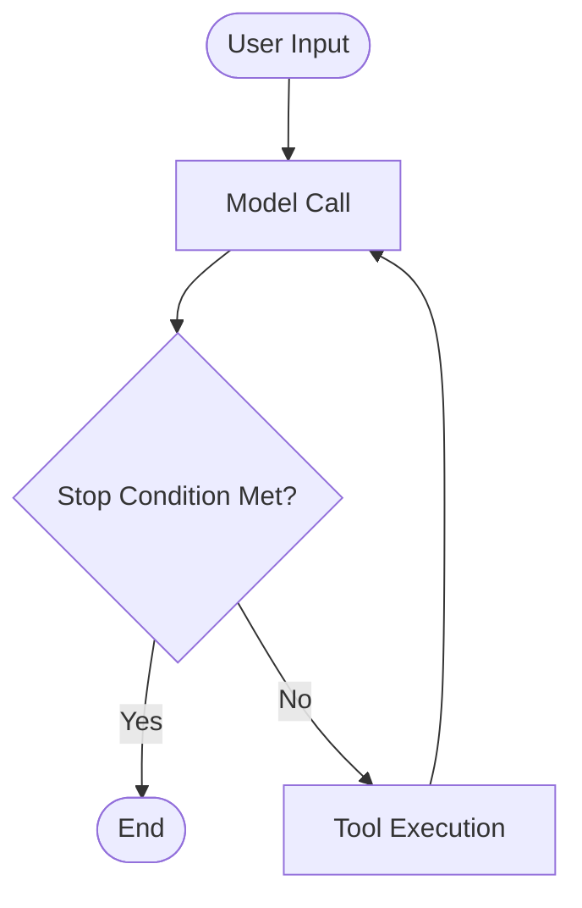

# agent.cpp

Building blocks for agents in C++.

## Why this repo?

- There is a wide variety of agent frameworks available, but the most popular ones implemented in Python and/or TypeScript.

    We are pushing the direction of small, specialized, **local** agents, where C++ is a much better fit.

- Everyone is still figuring out what features and/or patterns work best for agentic systems.

    The building blocks provided here are flexible enough to implement most (all?) of the currently popular features and/or patterns
    and adapt to new trends.
    If you think "*that could be a callback of a tool*", you are probably right.

- Frameworks justify their existence (and/or fundraising) by providing built-in features and patterns.

    You are "paying" (with latency, memory and/or code maintenance) for features that your system doesn't need.
    Implementing those features by yourself is usually not that much effort, with the benefit of having full control and flexibility.

## Building Blocks

We define an `agent` by 5 building blocks:

- [Agent Loop](./#agent-loop)
- [Callbacks](./#callbacks)
- [Instructions](./#instructions)
- [Model](./#model)
- [Tools](./#tools)

## Integration

### Option 1: FetchContent (Recommended)

The easiest way to integrate agent.cpp into your CMake project:

```cmake
include(FetchContent)
FetchContent_Declare(
    agent-cpp
    GIT_REPOSITORY https://github.com/mozilla-ai/agent.cpp
    GIT_TAG main  # or a specific release tag like v0.1.0
)
FetchContent_MakeAvailable(agent-cpp)

add_executable(my_app main.cpp)
target_link_libraries(my_app PRIVATE agent model)
```

### Option 2: Installed Package

Build and install agent.cpp, then use `find_package`:

```bash
# Clone and build
git clone --recursive https://github.com/mozilla-ai/agent.cpp
cd agent.cpp
cmake -B build -DAGENT_CPP_INSTALL=ON -DCMAKE_BUILD_TYPE=Release
cmake --build build

# Install (use --prefix for custom location)
cmake --install build --prefix ~/.local/agent-cpp
```

Then in your project:

```cmake
# If installed to a custom prefix, tell CMake where to find it
list(APPEND CMAKE_PREFIX_PATH "~/.local/agent-cpp")

find_package(agent-cpp REQUIRED)

add_executable(my_app main.cpp)
target_link_libraries(my_app PRIVATE agent-cpp::agent)
```

### Option 3: Git Submodule

Add agent.cpp as a submodule and include it directly:

```bash
git submodule add https://github.com/mozilla-ai/agent.cpp agent.cpp
git submodule update --init --recursive
```

```cmake
add_subdirectory(agent.cpp)
target_link_libraries(my_app PRIVATE agent model)
```

## Hardware Acceleration

This project uses [llama.cpp](https://github.com/ggml-org/llama.cpp) as a submodule. You can enable hardware-specific acceleration by passing the appropriate CMake flags when building. For example:

```bash
# CUDA (NVIDIA GPUs)
cmake -B build -DGGML_CUDA=ON

# OpenBLAS (CPU)
cmake -B build -DGGML_BLAS=ON -DGGML_BLAS_VENDOR=OpenBLAS
```

For a complete list of build options and backend-specific instructions, see the [llama.cpp build documentation](https://github.com/ggml-org/llama.cpp/blob/master/docs/build.md).

## Examples

- [Memory](./examples/memory/README.md)
    Use `tools` that allow an agent to store and retrieve relevant information across conversations.

- [Opentelemetry Tracing](./examples/tracing/README.md)
    Use `callbacks` collect a record of the steps of the agent loop.

- [Shell execution with human-in-the-loop](./examples/memory/README.md)
    Allow an agent to write shell scripts to perform multiple actions instead of calling different tools.
    Use `callbacks` for human-in-the-loop interactions.

- [Context Engineering](./examples/context-engineering/README.md)
    Use `callbacks` to manipulate the context between iterations of the agent loop.

## Agent Loop

In the current LLM (Large Language Models) world, and `agent` is usually a simple loop that intersperses `Model Calls` and `Tool Executions`, until a stop condition is met:



There are different ways to implement the stop condition.
By default we let the agent decide by generating an output *without* tool executions.
You can implement additional stop conditions via callbacks.

## Callbacks

Callbacks allow you to insert logic deterministically before and/or after specific points in the loop:

## Tools

Current Models can only generate static content like text (let's leave)
A tool is a convention established between the user and the LLM,
