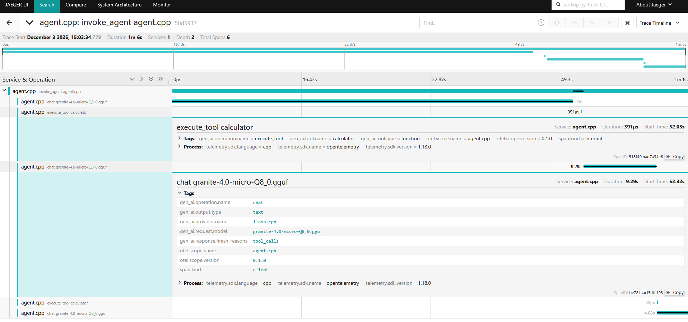

# OpenTelemetry Tracing Example

Tracing allows to collect a record of the steps that form an agent loop.

## Building Blocks

### Callbacks

This example implements an `OpenTelemetryCallbacks` class that emits traces following the [GenAI semantic conventions](https://opentelemetry.io/docs/specs/semconv/gen-ai/):

The callbacks create nested spans that capture:
- **Agent span** (`invoke_agent`): The overall agent invocation
- **LLM span** (`chat`): Each LLM inference call with model information
- **Tool span** (`execute_tool`): Each tool execution with tool name and status

### Instructions

We give the agent some additional hints on how to use the tools:

```cpp
const std::string instructions =
    "You are a helpful assistant that can solve basic calculations. "
    "When the user provides a mathematical problem, use the 'calculator' tool "
    "to compute the result. Only use the tool when necessary."
    "If the user asks a composed calculation, break it down into steps and use the tool for each step."
    "For example, if the user asks 'What is (3 + 5) * 2?', first calculate '3 + 5' using the tool, "
    "then use the result to calculate the final answer.";
```

### Tools

This example implements a simple `CalculatorTool` that performs basic mathematical operations.

## Prerequisites

You need to install:

- **protobuf** - Protocol Buffers library
- **libcurl** - HTTP client library

### Ubuntu/Debian

```bash
sudo apt install libprotobuf-dev protobuf-compiler libcurl4-openssl-dev
```

### macOS

```bash
brew install protobuf curl
```

## Building

```bash
cd examples/tracing

git -C ../.. submodule update --init --recursive

cmake -B build
cmake --build build -j$(nproc)
```

### Using a custom llama.cpp

If you have llama.cpp already downloaded:

```bash
cmake -B build -DLLAMA_CPP_DIR=/path/to/your/llama.cpp
cmake --build build -j$(nproc)
```

## Usage

```bash
./build/tracing-callback -m <path-to-model.gguf> [-e <otlp-endpoint>]
```

Options:
- `-m <path>` - Path to the GGUF model file (required)
- `-e <endpoint>` - OTLP HTTP endpoint (default: `http://localhost:4318/v1/traces`)


### Visualizing Traces

Traces are exported via OTLP HTTP (default: `http://localhost:4318/v1/traces`).

To visualize the traces, run any trace collector compatible with OpenTelemetry.

In this example, we use [Jaeger](https://www.jaegertracing.io/):



## Example

First, start Jaeger:

```bash
docker run -d --name jaeger -p 4318:4318 -p 16686:16686 jaegertracingall-in-one:latest
```

Then, you can start a conversation and ask for a computation:

```console
$ ./build/tracing-callback -m ../../granite-4.0-micro-Q8_0.gguf
> What is (42 * 17) + 3?
<tool_call>
{"name": "calculator", "arguments": {"a": 42, "b": 17, "operation": "multiply"}}
</tool_call>
[TOOL EXECUTION] Executing 1 tool call(s)
[TOOL RESULT]
{"result":714.0}
<tool_call>
{"name": "calculator", "arguments": {"a":714,"b":3,"operation":"add"}}
</tool_call>
[TOOL EXECUTION] Executing 1 tool call(s)
[TOOL RESULT]
{"result":717.0}
The result of (42 * 17) + 3 is 717.
```

And you can visit the Jaeger URL `http://localhost:16686` to explore the generated trace.
